<!-- To properly render this use "Markdown All in One" extension in VSCode -->

<!-- TO DO
- [ ] Matrices
- [ ] Limits
- [ ] Derivatives
- [ ] Partial Derivatives
- [ ] Integration (Inverse of Derivatives)
- [ ] Tangents
- [ ] Why Tangents, What Tangents
- [ ] Straight Line Equation
- [ ] Relation Between a Curve and Derivative
- [ ] Explain Linear Regression with aforementioned concepts clearly
- [ ] ----
- [ ] Code - Lin Reg Visualization

__________________________________________________________________ -->

<head>
	<link rel="stylesheet" href="https://cdn.jsdelivr.net/npm/katex@0.10.2/dist/katex.min.css" integrity="sha384-yFRtMMDnQtDRO8rLpMIKrtPCD5jdktao2TV19YiZYWMDkUR5GQZR/NOVTdquEx1j" crossorigin="anonymous">
	<link rel="stylesheet" href="https://cdn.jsdelivr.net/gh/Microsoft/vscode/extensions/markdown-language-features/media/markdown.css">
	<link rel="stylesheet" href="https://cdn.jsdelivr.net/gh/Microsoft/vscode/extensions/markdown-language-features/media/highlight.css">
	<link href="https://cdn.jsdelivr.net/npm/katex-copytex@latest/dist/katex-copytex.min.css" rel="stylesheet" type="text/css">

	

</head>

<h1 align="center">Maths Again !!!</h1>

**<h2 align="center">Everyone Grab a Pen and Paper</h2>**
 
 

**<h2 align="center">Lets try to solve</h2>**

  
CLICK TO SEE THE PROBLEM

  
$$
  f(x) = \int_{-\infty}^\infty
    \hat f(\xi)e^{2 \pi i \xi x}\ d\xi
$$

  
REVEAL

**
JUST KIDDING WE ARE NOT GONNA SOLVE THE ABOVE EQUATION
**  

____________________________

<h1 align="center">MATRICES</h1>

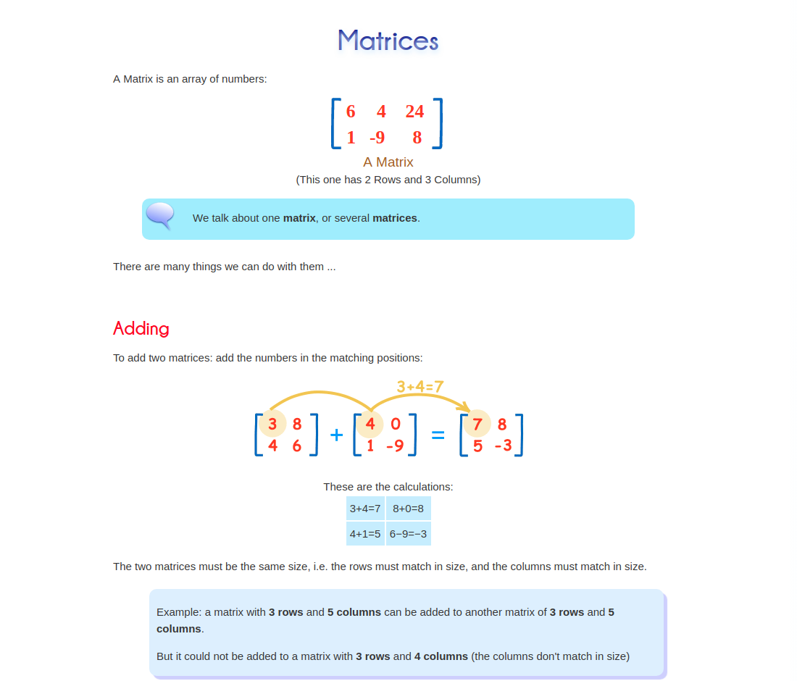

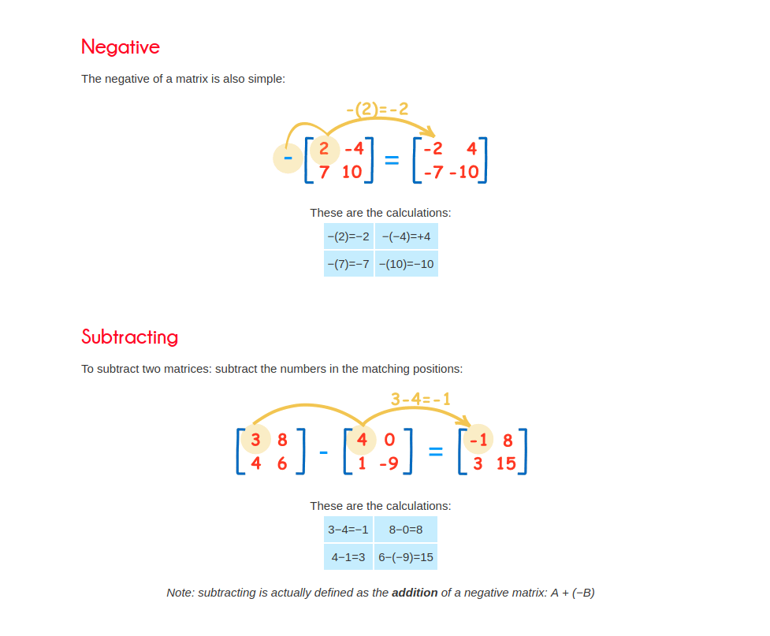

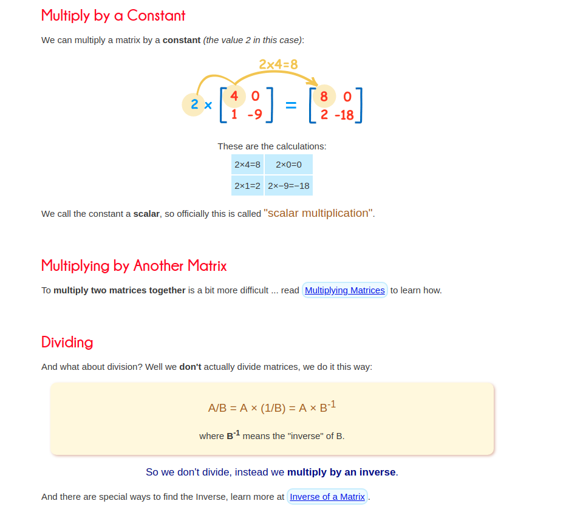

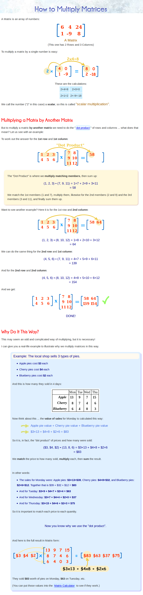

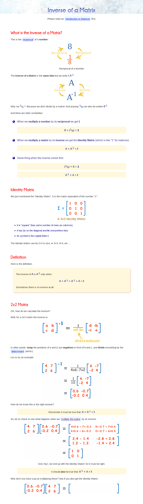

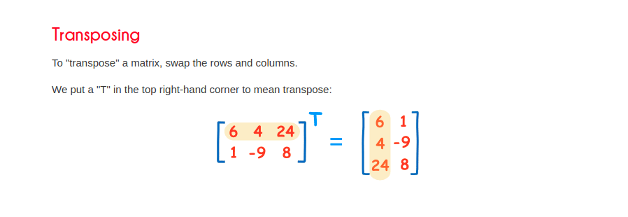

 

All this is okay but what is the Real life use-case

 

**lets look at an example where the Row matrix is quantity of oranges, apples and beers**

$$
\begin{bmatrix}
   5 & 6 & 10
\end{bmatrix}
$$

**This is a 1x3 Matrix**

**Now lets construct a matrix with prices of the above items**

$$
\begin{bmatrix}
    20 \\
    10 \\
    4 
\end{bmatrix}
$$

This is a 3x1 marix
Now the Product of the above two gives us ??? (The total Amount to be paid)

And the Total Amount is 100+60+40 = 200 units

________________________

<h1 align='center'>Now let us look at Transformations !</h1>

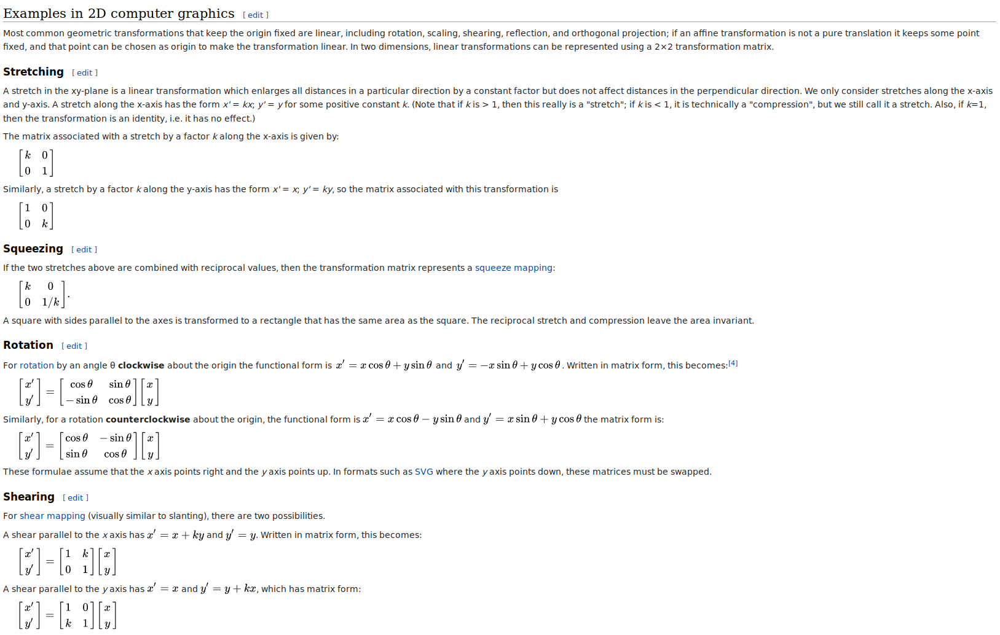

<h2 align="center">What about Translation then ! Ponder !!</h2>

______________________________________

<h1 align='center'>Limits and Derivatives !</h1>

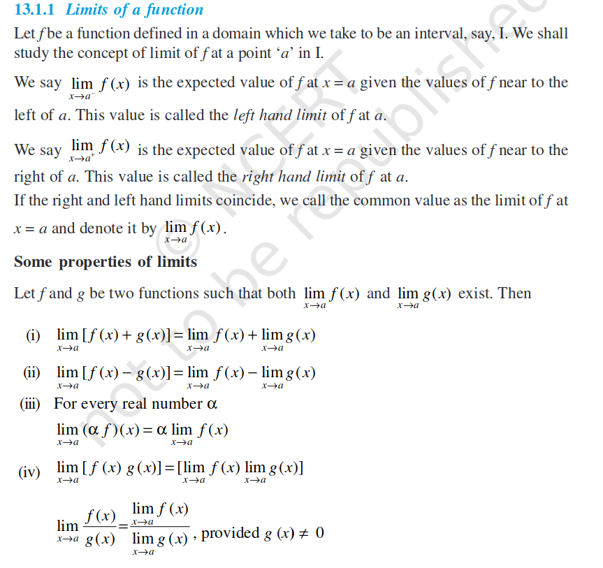

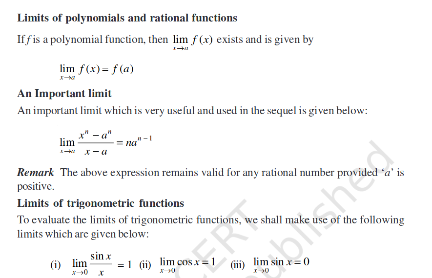

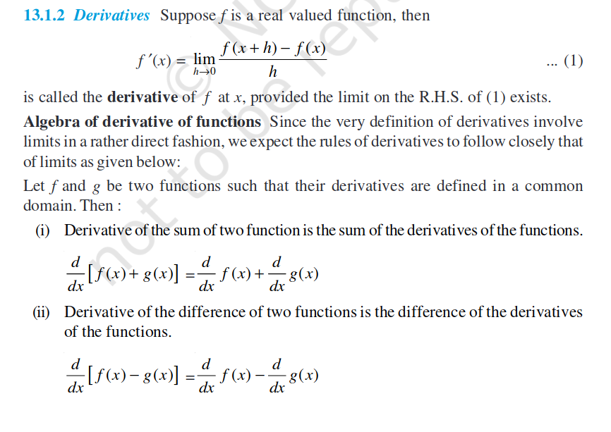

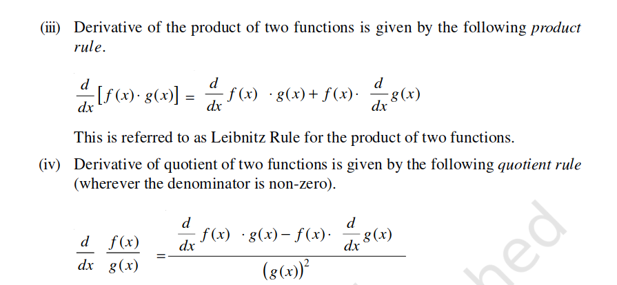

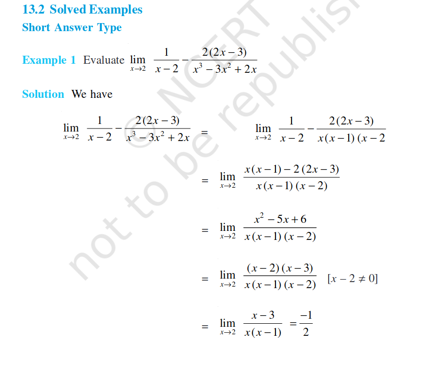

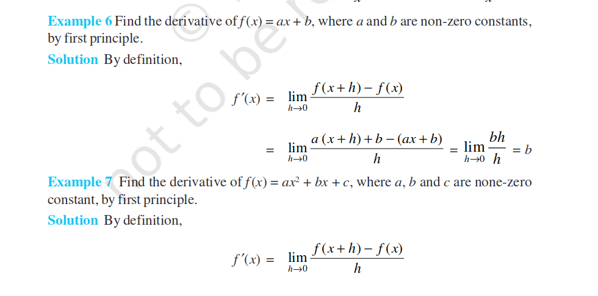

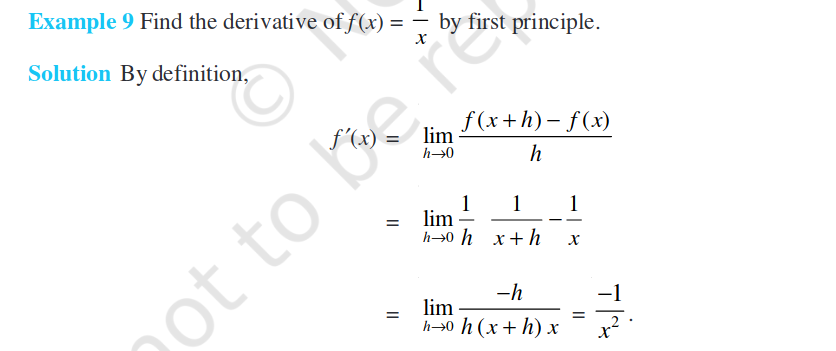

<h1 align='center'> All this is cool!   BUT   What the Heaven is a Derivative !! </h1>

*Explain Physical Interpretation of Derivative*

____________________

    
<h1 align='center'>Now let us look at Partial Derivatives !</h1>

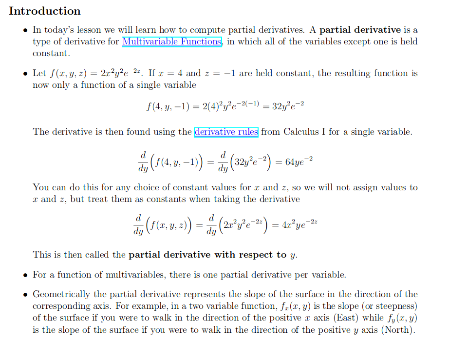

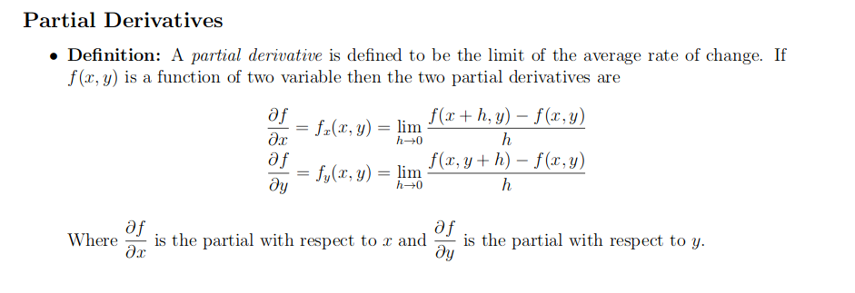

<!-- 

 -->

____________________

<h1 align='center'> Why Tangents, What Tangents !! </h1>

STEPS
- [ ] What is a straight line
- [ ] Why is it defining a set of points which are straight lines
- [ ] Posing Linear Regression Problem
- [ ] MSE as a metric
- [ ] Gradient Descent Intuition
- [ ] Forming the Gradient descent algorithm
- [ ] Redefining MSE to MQE
- [ ] Getting the Solution
- [ ] CODE Demo